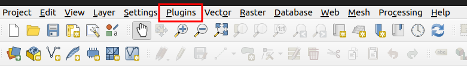
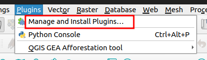
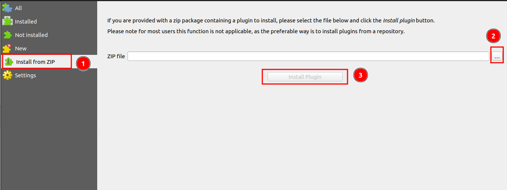
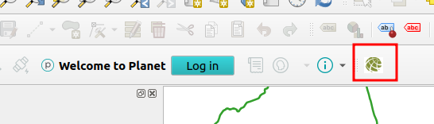
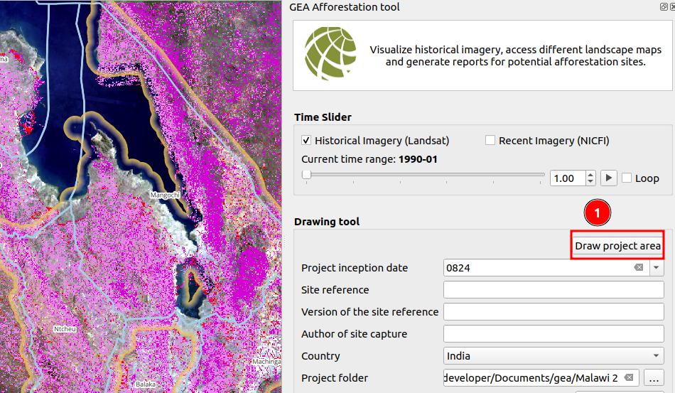
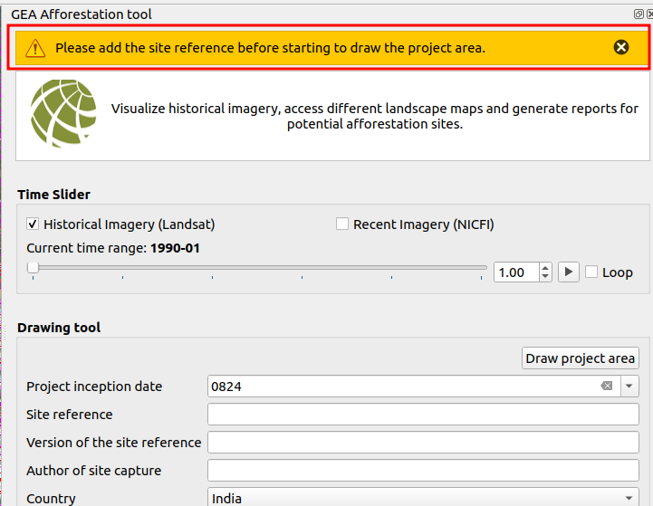
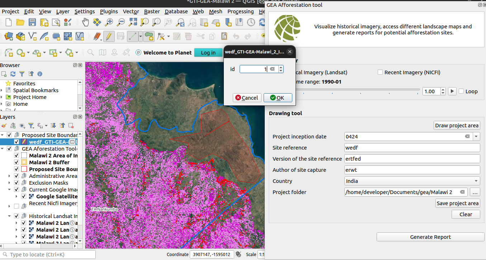
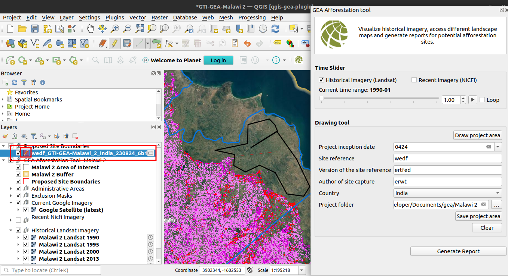
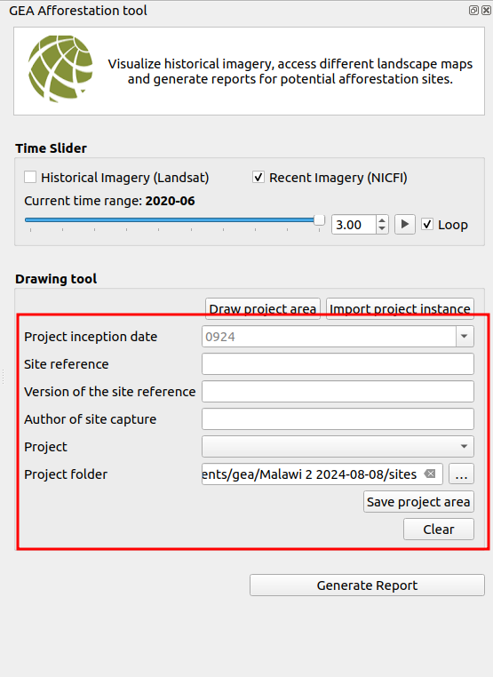
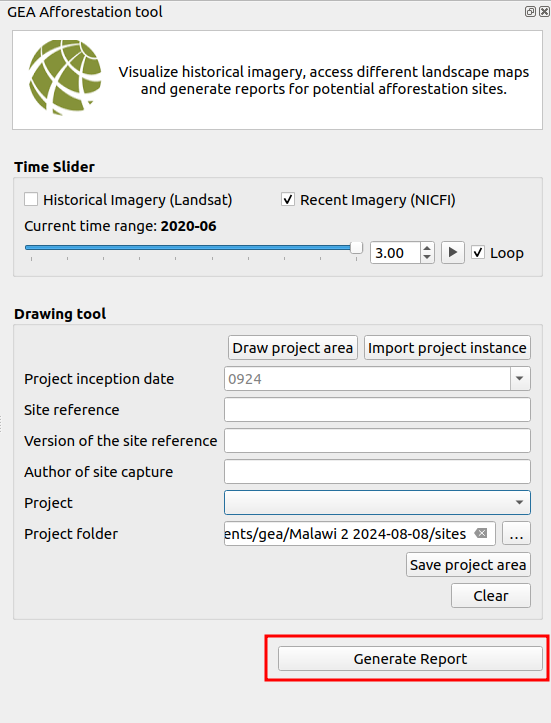

# GEA Reforestation Tool Plugin User Guide

This user guide will walk you through how you can install the plugin, how to use the time slider and how to generate the reports.

## How to install the plugin?

There are two ways to install the plugin 1. from the repository and 2. install from ZIP

### 1. Install from the repository

**Prerequisites:**

- QGIS installed on your computer. If QGIS is not installed on you system you can refer to [QGIS installation](../quickstart/index.md) for detailled instruction on how to install QGIS.

- The plugin URL (available from the [Plugins GitHub Repository](https://github.com/kartoza/qgis-gea-plugin))

**Step 1 Open QGIS:** Launch the QGIS application on your computer.

**Step 2 Access the Plugins Menu:** Look at the top of the QGIS window. In the navbar section, you will see a `Plugins` option. Click on it.

**Step 3 Open the Plugin Manager:** From the dropdown menu that appears, select `Manage and Install Plugins...`.

**Step 4 Add the Plugin URL:** 
In the Plugin Manager window, click on the 1️⃣ `Settings` tab. Look for the 2️⃣ `Add` button and click it.

A pop-up window will appear. Here, you need to enter two things. 1️⃣ `Name`, give a name to identify this plugin repository 2️⃣ `URL`, paste the plugin URL you got from the GitHub repository. After entering these details, click on the 3️⃣ `OK` button.

You should now see that the plugin repository has been added successfully.

**Step 5 Install the GEA Reforestation Tool Plugin:** In the Plugin Manager, click on the 1️⃣ `All` tab and use the 2️⃣ `search bar`, type `QGIS GEA afforestation tool`. You should see the plugin in the list. Click on the 3️⃣ its name to select it. With the plugin selected, the 4️⃣ `Install` button should become active. Click on it to start the installation.

**Step 6 Verify Installation:**

After the installation is complete, you should see the plugin icon in your QGIS interface.

Congratulations! You have successfully installed the GEA Reforestation Tool plugin for QGIS. You can now start using it for your reforestation projects.

### 2. Install from zip

This guide will walk you through the process of installing the GEA Reforestation Tool plugin using a `ZIP` file.

## Prerequisites

- QGIS installed on your computer
- The plugin ZIP file in your project folder

## Installation Steps

**Step 1 Locate the Plugin ZIP File:**

Ensure that you have received the plugin ZIP file in your project folder. You can download the project folder from the below link.

https://drive.google.com/file/d/1bhqBV1aamOg_tbZI0BZGOMaSihEr6qLI/view?usp=sharing

**Step 2 Access the Plugins Menu:** Look at the top of the QGIS window. In the navbar section, you will see a `Plugins` option. Click on it.

**Step 3 Open the Plugin Manager:** From the dropdown menu that appears, select `Manage and Install Plugins...`.

**Step 4: Install from ZIP:** In the Plugin Manager window, click on the 1️⃣ `Install from ZIP` tab. Click on the 2️⃣ three dots (ellipsis) button next to the file path field and navigate to your project folder and select the plugin ZIP file you received. After selecting the ZIP file, the `Install Plugin` button will become enabled, click on the `Install Plugin` button to begin the installation process.

**Step 5 Confirm Installation:** QGIS will process the ZIP file and install the plugin. Once installation is complete, you should see a confirmation message. The GEA Reforestation Tool should now appear in your list of installed plugins.

Congratulations! You have successfully installed the GEA Reforestation Tool plugin from a ZIP file. You can now start using the tool in your QGIS projects.

## How to use the time slider?

You can user the time slider for Historical Landsat Imagery as well as for Recent Nicfi Imagery.

### Use time slider for Historical Landsat Imagery

Select the `Historical Imagery (Landsat)` checkbox, The slide bar represents a timeline of available historical imagery.

To view different time periods, click and drag the toggle on the slide bar. Move it left or right to navigate through time. As you move the toggle, the map canvas will update to display the corresponding imagery for that time period. Each increment on the slide bar represents a specific time period. Moving to the next or previous increment will show you how the landscape has changed over time.

**Using the Play Button:**

Look for the play button near the slide bar. Click the play button to automatically cycle through the historical imagery. This feature is excellent for visualising landscape changes over time without manual intervention.

**Activating the Loop Feature:**

Find the `Loop` checkbox next to the play button. Check this box if you want the playback to continuously loop through the imagery. When activated, the playback will restart from the beginning after reaching the most recent imagery.

## Use time slider for Recent Nicfi Imagery

Select the `Recent Imagery (Nicfi)` checkbox, The slide bar represents a timeline of available nicfi imagery.

To view different time periods click, and drag the toggle on the slide bar. Move it left or right to navigate through time. As you move the toggle, the map canvas will update to display the corresponding imagery for that time period. Each increment on the slide bar represents a specific time period. Moving to the next or previous increment will show you how the landscape has changed over time.

**Using the Play Button:**

Look for the play button near the slide bar. Click the play button to automatically cycle through the nicif imagery. This feature is excellent for visualising changes over time without manual intervention.

**Activating the Loop Feature:**

Find the `Loop` checkbox next to the play button. Check this box if you want the playback to continuously loop through the imagery. When activated, the playback will restart from the beginning after reaching the most recent imagery.

## Drawing Tool

This tutorial, will walk you through using the `Drawing Tool` to create project areas and how to generate automated reports.

**Accessing the Drawing Tool:** Click on the 1️⃣ `Drawing project area` button, in the QGIS interface. Ensure you have fill the required fields. If the any field is missing, you will see an error message.

- For eg. if you miss entering the site reference the error will show on the top.

    

**Draw the polygon:** After clicking on the `Draw Project Area` button. Click on the map to create vertices of your polygon. Once you complete the drawing right-click to finish drawing after that the pop-up window will open, enter the ID (should be 1).

**Editing the polygon:** After drawing, editing options will appear in the toolbar. The edit icon will show up next to the project in the layer list. Make any necessary modifications before saving.

**Entering Project Details:**

* Project Inception Date: Click on the date field to open a calendar and select the appropriate date for your project.

* Site Reference: Enter the site reference to identify the project location.

* Version of the Site Reference: Add the version number for tracking purposes.

* Author of the Site Capture: Enter the name of the person who recorded the site details.

* Country: Select the project's country from the dropdown list.

* Project Folder: Choose the folder where plugin data will be stored.
    
    > Note: A `Sites` directory will be automatically created for shape files.

**Saving the Project Area:** Click the `Save Project Area` button. Shape files will be saved in the `Sites` directory within your project folder.

**Clearing the Project Area:** Use the `Clear` button to remove the polygon from the map.

   - Important: Clear the polygon before saving a new project, as existing shape files in the Sites folder won't be automatically deleted.

## Automated Report Generation

**Generating an Automated Report:** After drawing and saving your project area, click the Generate Report` button. The system will create an automated report based on your project area and details.

By following these steps, you will be able to effectively use the Drawing Tool to define your project areas and generate automated reports for the GEA Reforestation project.
