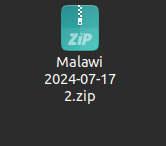
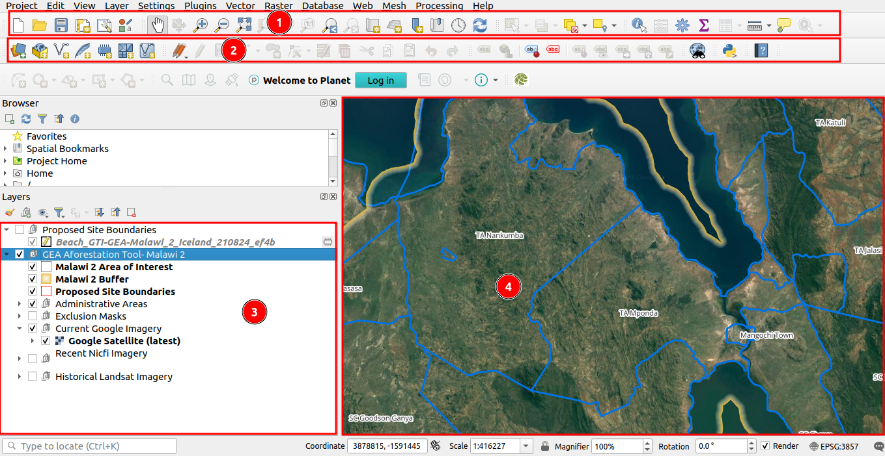
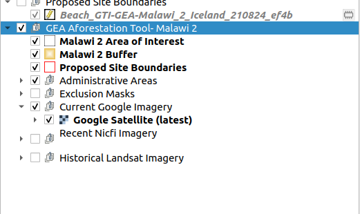
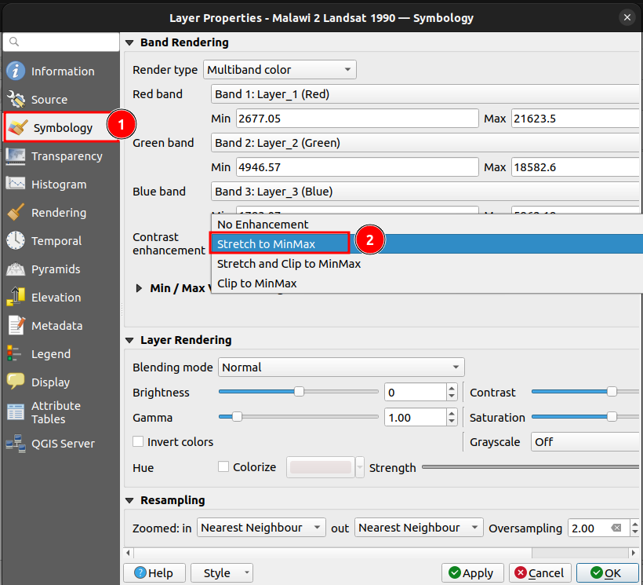

# The EPAL-Eligible Project Area Locator QGIS Project User Guide

## Introduction

Welcome to the user guide tutorial for the EPAL-Eligible Project Area Locator project using QGIS. This guide will walk you through the steps to get started with the project and how to use the various tools and features available.

The EPAL-Eligible Project Area Locator project is a collaborative effort between the Head Office and Field Office to track and manage reforestation activities. This project leverages the power of QGIS, a free and open-source geographic information system (GIS) software, to provide a comprehensive solution for the reforestation process.

## Getting Started:

**Accessing the Project Folder:** The project folder is shared by the Head Office and can be downloaded by the Field Office/You.

The folder should contain the following components:

- Masks
- Images
- Package for vector data
- QGIS project file (project.qgz)

**Extracting the Project Folder**:

- Download the project folder shared by the head office.

- Extract the folder to access the necessary files and folders.

## Opening the QGIS Project:

**Launching QGIS:** If you don't have QGIS installed on your system, refer to the [Quickstart Guide](../quickstart/index.md) for detailed instructions on how to install the QGIS.

**Opening the Project File:** Right-click on the 1️⃣ `project.qgz` file and select 2️⃣ `Open with QGIS`. This will launch the QGIS application and open the EPAL-Eligible Project Area Locator project.

## Exploring the QGIS Interface:

1. **Icons Toolbar -**

    a. Map Navigation Toolbar icons

    - **Pan**: Click on the 1️⃣ `Pan` icon, to pan the map canvas.

    - **Zoom In**: Click on the 2️⃣ `Zoom In` icon, and drag to select the area you want to zoom in on the map canvas.

    - **Zoom Out**: Click on the 3️⃣ `Zoom Out` icon, and drag to select the area you want to zoom out on the map canvas.

    - **Full Zoom**: Click on the 4️⃣ `Full Zoom` icon, to zoom to the full extent of the map.

    - **Show Map Tips**: Click on the 5️⃣ `Show Map Tips` icon, to display additional information about the map, such as coordinates and scale.

    

2. **Digitising toolbar icons:** 

    - **Current edits:** 1️⃣ `Current edits` display the current editing state of the layer.

    - **Toggle editing:** Click on the 2️⃣ to toggle the editing mode on or off.

    - **Save layer edits:** Click on the 3️⃣ to save any changes made to the layer.

    - **Add polygon feature:** Click on the 4️⃣ to create a new polygon feature on the map.

3. **List of layer in the Layers Panel:**

You can use the `Layers` panel to visualise and interact with the various layers in the project. In the Layers panel, you will see the following layers listed:

- Project Instances
- Malawi 2 Buffer
- Malawi 2 Area of Interest
- Proposed Site Boundaries
- Administrative Areas (Malawi 2 Country, Malawi 2 District, Malawi 2 Sub-divisional Administrative Unit)
- Exclusion Masks (Grass, Wetland, Forest, Soil Carbon)
- Current Google Imagery
- Recent NICFI Imagery
- Historical Landsat Imagery

**Exploring the Layers:**

**Project Instances:**

- `Project Instances` This layer contains all the project instances the user has drawn on the canvas, including the imported ones.

- Check the instance checkbox to visualise the instance on the map.

**Malawi 2 Buffer:**

- Check the `Malawi 2 Buffer` checkbox to visualise the buffer area around the Malawi 2 area of interest. You will see a yellow line on the map canvas.

**Malawi 2 Area of Interest:**

- Check the `Malawi 2 Area of Interest` checkbox to visualise the area of interest on the map canvas. You will see a black line outlining the area.

**Proposed Site Boundaries:**

- Check the `Proposed Site Boundaries` checkbox to display the proposed boundaries created by the user for the project. You will see red lines on the map canvas representing the proposed boundaries.

**Administrative Areas:**

- Malawi 2 Country: Check the `Malawi 2 Country` checkbox to visualise the country boundaries of Malawi. You will see a green line on the map canvas.

- Malawi 2 District: Check the `Malawi 2 District` checkbox to visualise the district boundaries within Malawi. You will see white lines on the map canvas.

- Malawi 2 Sub-divisional Administrative Unit: Check the `Malawi 2 Sub-divisional Administrative Unit` checkbox to visualise the sub-divisional administrative unit boundaries within Malawi. You will see blue lines on the map canvas.

**Exclusion Masks:**

- Malawi 2 Grass Exclusion Mask
- Malawi 2 Wetland Exclusion Mask
- Malawi 2 Forest Exclusion Mask
- Malawi 2 Soil Carbon Exclusion Mask

Check the respective checkboxes to visualise the exclusion masks on the map canvas. These masks represent areas where the project cannot be implemented.

**Imagery Layers:**

- **Current Google Imagery:** Check the checkbox to view the most recent `Google imagery`.

- **Recent NICFI Imagery:** To view the `NICFI` imagery, you need to turn off the Google Imagery and Historical Landsat Imagery layers first and select the recent NICFI imagery.

>NOTE: To view the NICFI imagery you need to register/log in to the Planet Explore site. If you are not already registered on the site you can refer to the below links for the detailed documentation on register/log in.

- [Register to the Planet Explore site](./sign-up.md)

- [Login to the Planet Explore site](./login.md)

- **Historical Landsat Imagery:** Check the checkbox to view the historical Landsat imagery. You need to turn off the Google Imagery and NICFI Imagery layers to see the `Historical Landsat imagery`.

By selectively toggling the visibility of the different layers, you can customise the map view and gain valuable insights for the EPAL-Eligible Project Area Locator Project.

With the EPAL-Eligible Project Area Locator QGIS project opened and the basic navigation tools explored, you are now ready to dive deeper into the project and start working on the reforestation activities. 

## How to style an image for better visualisation?

This user guide will show you how to change the image styles in QGIS symbology to enhance the quality and realism of your images.

**Step 1: Open QGIS and Load Your Project**

To get started, open QGIS and load your existing project, or simply open your QGIS project (e.g. Malawi 2) with QGIS.

**Step 2: Open the Layer Properties**

In the Layers panel, right-click on the layer for which you want to change the symbology and select the 1️⃣ `Properties`. This will open the Layer Properties dialog box.

**Step 3: Open the Symbology Tab**

In the Layer Properties dialog box, click on the 1️⃣ `Symbology` tab on the left side. This will open the Symbology settings. In the Symbology settings, locate the settings for contrast enhancement. In the contrast enhancement dropdown, select the 2️⃣ `Stretch to MinMax` option. This will adjust the contrast of the image to make it more visually appealing.

**Step 4: Configure Min/Max Value Settings**

Click on the 1️⃣ `Min/Max value setting` to view more options. Choose the 2️⃣ `Mean +/- standard deviation` option. This will adjust the minimum and maximum values of the image to make it more realistic. Click on the 3️⃣ `Apply` to apply the changes and continue making adjustments. Alternatively, click on the 4️⃣ `OK` to apply the changes and close the Layer Properties window.

By following these steps, you can change the image styles in QGIS symbology to enhance the quality and realism of your images. Remember to experiment with different settings to get the most realistic-looking or fit-for-purpose image.
