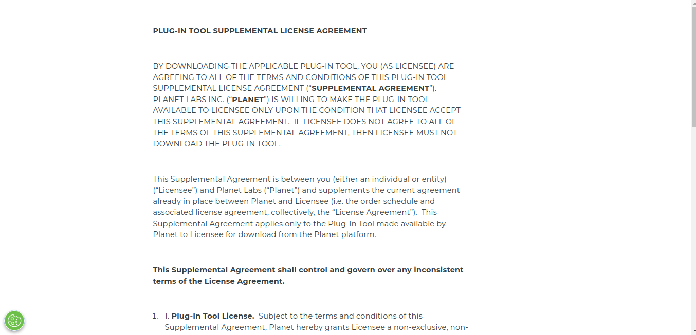
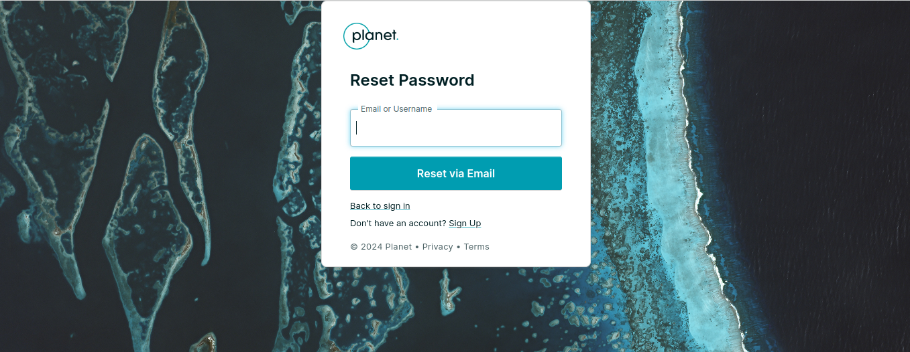

# User Guide: Logging In

## Why Logging In is Important

Logging into Planet.com is important for accessing the latest NICFI imagery. Through Norway’s International Climate & Forests Initiative (NICFI), users can use Planet’s high-resolution, analysis-ready mosaics of the world's tropics. This data is essential for efforts to reduce and reverse the loss of tropical forests, combat climate change, and conserve biodiversity.

## Logging In

Click on the 1️⃣ `Login` button in QGIS. Upon clicking, the sign-in form will open.

## Sign-In Form

Enter your registered email address into the 1️⃣ `Email` field and enter the password you set up during the registration process into the 2️⃣ `Password` field. Check the 3️⃣ `Save credentials` box if you want the website to remember your email and password for future logins. This will keep you logged in on the same device and browser. Click on the 4️⃣ `Sign In` button to submit your credentials.

Additional Information

### Agree to Terms and Conditions
By logging in, you agree to Planet.com's [Terms and Conditions](https://learn.planet.com/QGIS-terms-conditions.html).

### Not a Member?
If you are not a member and wish to become one, [contact Planet's team for assistance](https://www.planet.com/contact/).

### Forgot Password?
If you have forgotten your password, you can reset it using the [Forgot Password link](https://account.planet.com/signin/forgot-password).

By following this guide, you should be able to log into your Planet.com account easily. Logging in is essential for accessing NICFI imagery and contributing to global efforts in climate change mitigation and biodiversity conservation.