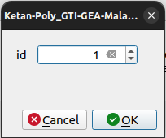

# GEA Reforestation Tool (Plugin) User Manual

Welcome to the GEA Reforestation Tool user manual. This guide will help you navigate and utilise the tool to visualise historical imagery, access different landscape maps, and generate reports for potential reforestation sites.

1. **Time Slider:** Allows users to view selected imagery on the map canvas. Users can drag the toggle to the next or previous increment to view the corresponding imagery

2. **Drawing Tool:** Allows users to draw polygons on the map canvas. Users can use the `Draw Project Area` button to draw a polygon. Users must provide site reference, project inception date, site reference version, author of site capture, and country before drawing the polygon.

3. **Generate Report:** Click on the generate report button to generate an automated report.

## Time Slider 

**Slide Bar:** The slide bar allows users to view the selected imagery on the map canvas. The functionality of the slide bar depends on the checkbox selection:

- **Historical Imagery (Landsat) Checkbox Checked:** The map canvas will display historical imagery from Landsat.

- **Recent Imagery (Nicfi) Checkbox Checked:** The map canvas will display recent imagery from NICFI.

The user can use the slide bar by dragging the toggle to the next or previous increment to view the corresponding imagery on the map canvas.

**Play Button:** The play button allows users to play through the selected imagery. This feature is useful for visualising changes in the landscape over time.

**Frame Rate:** allows users to set the frame rate to a larger or smaller number to play through the images quicker or slower respectively

**Loop Checbox:** This checkbox allows the user to continuously loop through the selected images.

****Current Time Range:** Current time range shows the year and month of the image being shown on the map canvas.

**Historical Imagery**

**Recent Imagery**

## Drawing tool

The user can use the drawing tool to draw polygons on the map canvas.
    

5.1 **Draw Project Area Button:** The user can use this button to draw the polygon on the map canvas. Before using the `Draw Project Area` button, ensure that the site reference has been provided. After drawing the polygon right-click. Upon clicking the pop-up will open for entering the ID, ID should be 1.

- **Error Handling:** If any of the fields is empty, an error message will be displayed for example for the site reference field the message would be: `Please add the site reference before starting drawing the project area.`

    

- **Editing:** After drawing the polygon, you can edit it using the options available in the toolbar. The edit icon will appear in front of the project in the layer list, allowing modifications before saving.

    

5.2 **Project Inception Date:** To choose the project inception date, click on the field to open a calendar. Select the desired date from the calendar interface.

5.3 **Site Reference:** Enter the site reference to identify the specific location or area for the project.

5.4 **Version of the Site Reference:** Add the version number corresponding to the site reference for version control and tracking.

5.5 **Author of the Site Capture:** Enter the name of the individual who captured or recorded the site details.

5.6 **Country Dropdown:** Choose the country from the dropdown list to specify the location of the project.

5.7 **Project Folder:** Select the project folder where plugin data is stored. The shape files will be saved in the `Sites` directory, which is automatically generated when you save the project.

5.8 **Save Project Area Button:** Click the `Save Project Area` button to save the project after drawing the polygon. The shape files will be stored in the `Sites` directory.

5.9 **Clear Button:** Use the `Clear` button to remove the polygon from the map. Note that the polygon must be cleared before saving the project, as shape files stored in the sites folder will not be deleted after saving.

## Automated Report

Click on the generate report button to generate an automated report.
