# EPAL-Eligible Project Area Locator Tool (Plugin) User Manual

Welcome to the EPAL-Eligible Project Area Locator Tool user manual. This guide will help you navigate and utilise the tool to visualise historical imagery, access different landscape maps, and generate reports for potential reforestation sites.

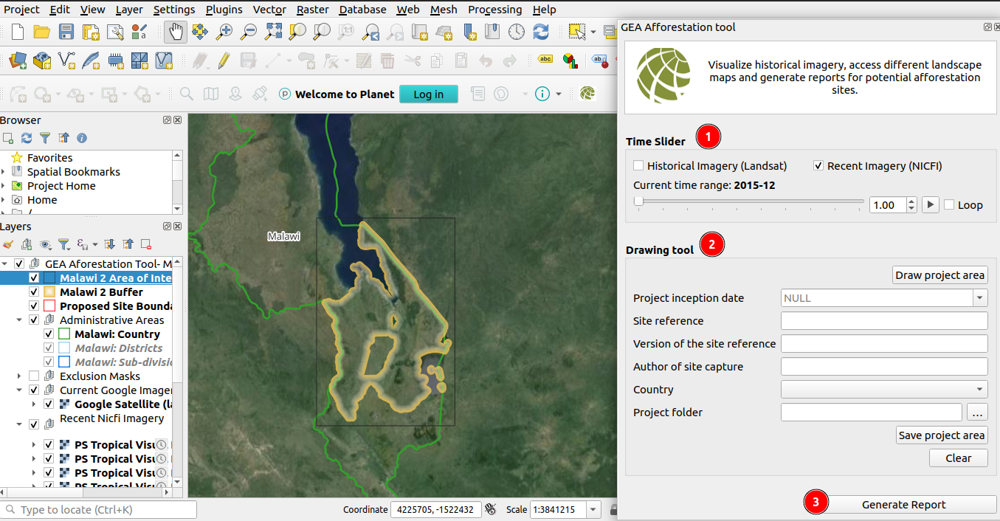

1. **Time Slider:** Allows users to view selected imagery on the map canvas. Users can drag the toggle to the next or previous increment to view the corresponding imagery

2. **Drawing Tool:** Allows users to draw polygons on the map canvas. Users can use the `Draw Project Area` button to draw a polygon. Users must provide site reference, project inception date, site reference version, author of site capture, and country before drawing the polygon. Additionally, users can generate a report by clicking the `Generate Report` button

<!-- 3. **Generate Report:** Click on the generate report button to generate an automated report. -->

## Time Slider 

**Slide Bar:** The slide bar allows users to view the selected imagery on the map canvas. The functionality of the slide bar depends on the checkbox selection:

- **Historical Imagery (Landsat) Checkbox Checked:** The map canvas will display historical imagery from Landsat.

    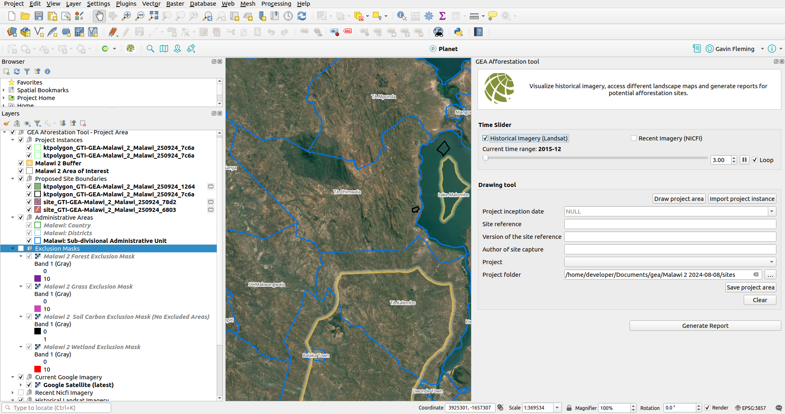

- **Recent Imagery (NICFI) Checkbox Checked:** The map canvas will display recent imagery from NICFI.

    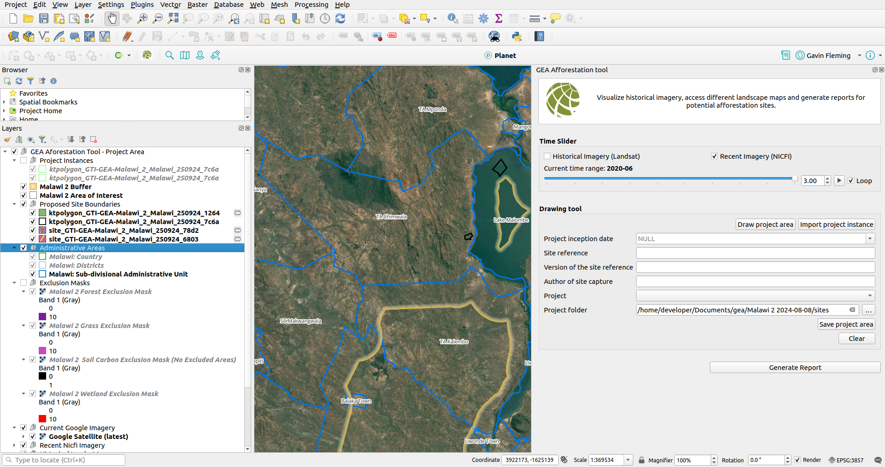

The user can use the slide bar by dragging the toggle to the next or previous increment to view the corresponding imagery on the map canvas.

**Play Button:** The play button allows users to play through the selected imagery. This feature is useful for visualising changes in the landscape over time.

**Frame Rate:** allows users to set the frame rate to a larger or smaller number to play through the images quicker or slower respectively

**Loop Checbox:** This checkbox allows the user to continuously loop through the selected images.

****Current Time Range:** Current time range shows the year and month of the image being shown on the map canvas.

**Historical Imagery**

**Recent Imagery**

## Drawing tool
    
The user can use the drawing tool to draw polygons on the map canvas.
    
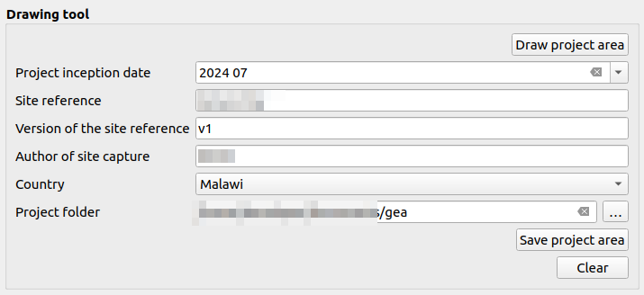

**Draw Project Area Button:** The user can use this button to draw the polygon on the map canvas. Before using the `Draw Project Area` button, ensure that the site reference has been provided.

* **Error Handling:** If any of the fields is empty, an error message will be displayed for example trying to draw polygon before filling in any details: `Please complete the attributes form before drawing the site polygon. This ensures all necessary details are captured accurately`.

    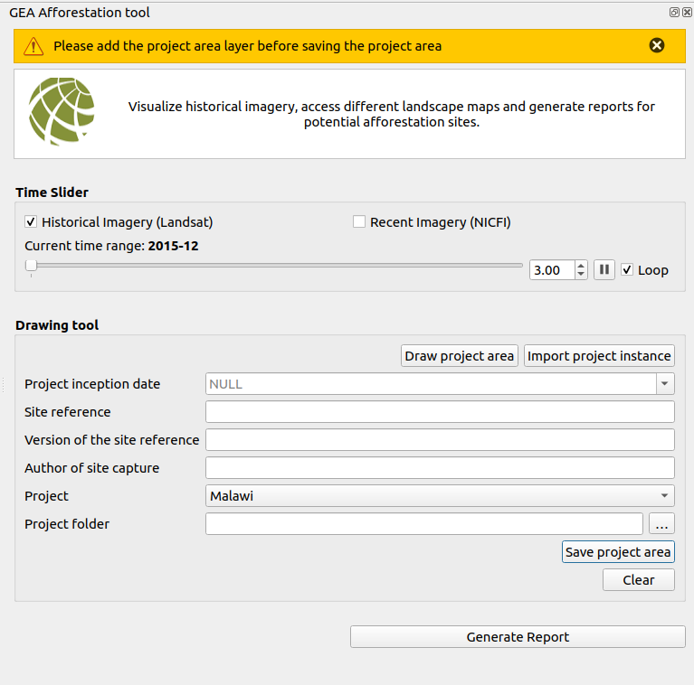

* **Editing:** After drawing the polygon, you can edit it using the options available in the toolbar. The edit icon will appear in front of the project in the layer list, allowing modifications before saving.

    

* **Project Inception Date:** To choose the project inception date, click on the field to open a calendar. Select the desired date from the calendar interface.

    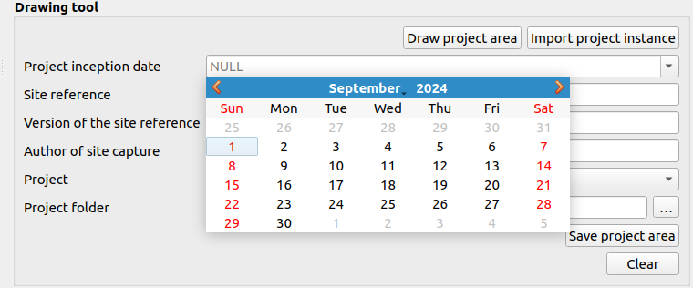

* **Site Reference:** Enter the site reference to identify the specific location or area for the project.

* **Version of the Site Reference:** Add the version number corresponding to the site reference for version control and tracking.

* **Author of the Site Capture:** Enter the name of the individual who captured or recorded the site details.

* **Country Dropdown:** Choose the country from the dropdown list to specify the location of the project.

* **Project Folder:** Select the project folder where plugin data is stored. The shape files will be saved in the `Sites` directory, which is automatically generated when you save the project.

    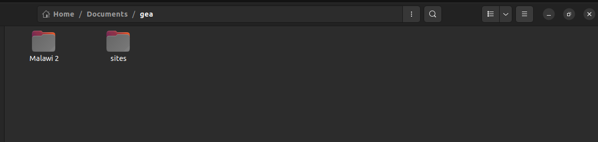

* **Save Project Area Button:** Click the `Save Project Area` button to save the project after drawing the polygon. The shape files will be stored in the `Sites` directory.

* **Clear Button:** Use the `Clear` button to remove the polygon from the map. Note that the polygon must be cleared before saving the project, as shape files stored in the sites folder will not be deleted after saving.

**Import project instance:** The user can use the `Import project instance` button to import project instances directly from the system. After clicking on the `Import project instance` button, a pop-up window will appear where the user can select an instance from the available options.

* **Cancel:** Close the pop-up window.
* **Open:** Select the file and click on the `Open button` to proceed.
* **Shapefiles:** Extension of the file.

After selecting the desired project instance user will click on the `open` button and a pop up project instance attributes dialog box will appear.

* **X:** Close the pop-up dialog box. 
* **Report Author:** The name of the person generating the report.
* **Project:** The name of the country where the project is located.
* **Cancel:** Terminate the process.
* **Save:** Save the instance to proceed.

**Error Message:** If the author, project, IncepDate, or area names are already present in the project instance, you will encounter this error.

* **X:** Close the window.
* **No:**  Cancel the process.
* **Yes:** Overwrite names.

## Coordinate

 

1. **Copy Coordinate:** Users can copy coordinates by right-clicking anywhere on the map, which opens the Copy Coordinates tab. Hovering over this tab provides various options for copying the coordinates users can copy coordinates by clicking on any option.

* **Map CRS:** Map CRS (Coordinate Reference System) defines how geographic coordinates (latitude and longitude) are mapped onto a flat surface, ensuring accurate spatial representation and measurements.

* **ESPG:** EPSG (European Petroleum Survey Group) codes are numerical identifiers for specific Coordinate Reference Systems (CRS) used to standardise geographic and spatial data. For example, EPSG:4326 represents the WGS84 system, commonly used for global mapping.

* **Set Custom CRS:** Users can create custom CRS (Coordinate Reference System).

    

## Project Instances 

After importing the project instances or drawing them manually, they will be added to the `Project Instances` group within the `Layers` section.

### Attribute Table

The attribute table contains information about the project instances, including the farmer's ID and other relevant details associated with the land. This table provides an organized view of all the data linked to each farmer and their land.

* To open the attribute table right click on the project instance and choose 1️⃣ `Open Attribute Table` from the menu.

    

* The attribute table will look like this.

    

* These are the major details in the attribute table, associated with each farmer's ID.

    

    **1. author:** ID of the associated author.

    **2. project:** Country of the project.

    **3. IncepDate:**  Date when the project started.
    
    **4. area(ha):** Area of the land in hectares (rounded to 2 decimal places).

## Automated Report

1. **Generate Report:** Click on the `Generate Report` button to generate an automated report.

    After clicking on the 1️⃣ `Generate Report`, a `Report Progress` pop-up window will appear, showing the current status of the report generation process.

    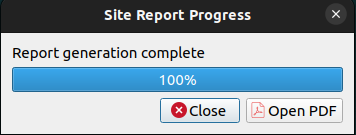

    * **Progress Bar:** Displaying the current status of the process.
    * **cancel:** Cancel the process.
    * **Open reports folder:** Open the folder that contains all the generated reports along with the file which contains land location.

         

* The report will be generated based on the farmer's ID. If there are multiple farmers, the system will generate individual reports for each farmer.

* Double-click on any report to open it.

## Generated Report

This is the report generated after completing the process.

### Report for imported instances

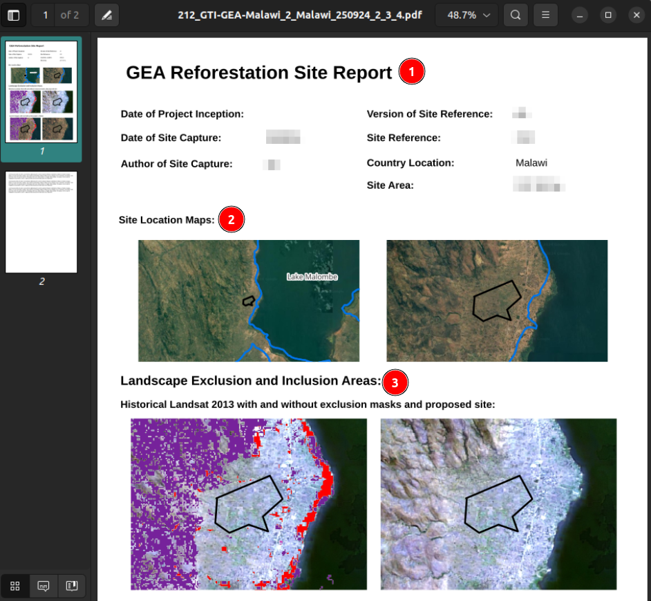

1. **Area Eligibility:** Displaying the ID of the farmer.
    - **Date of Project Inception:** The date when the project started.
    - **Project:** The name of the country.
    - **Report Author:** The person who captured the site.
    - **Total Area:** The area of the site.

2. **Project Instance Sites:** Displaying the site location on the map.

3. **Landscape Exclusion and Inclusion Areas:**  Displaying the Historical Landsat 2013 with and without exclusion masks and the proposed site.

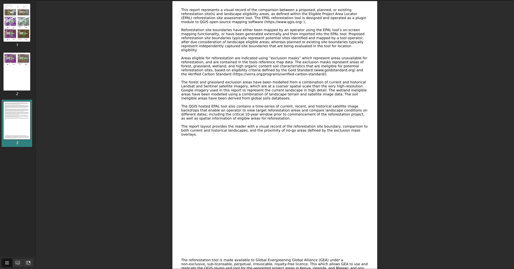

### Report for drawing instances

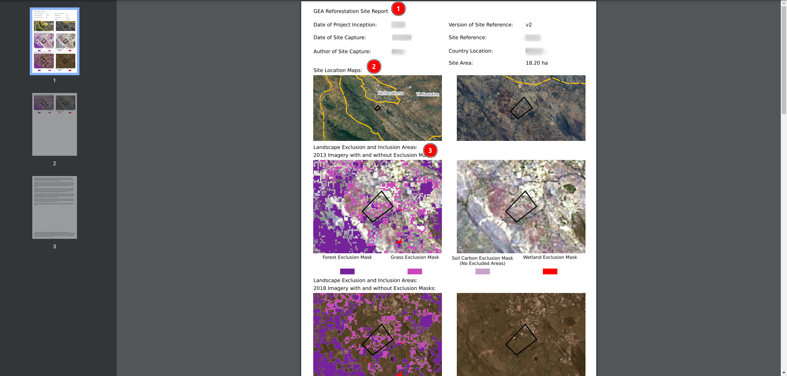

1. **GEA Reforestation Site Report:** Contains the information about the site.
    - **Date of Project Inception:** The date when the project started.
    - **Version of Site Reference:** Version of the site reference.
    - **Date of Site Capture:** The date when the site was captured.
    - **Site Reference:** Name of the site reference.
    - **Author of Site Capture:** Name of the person who captured the site.
    - **Country Location:** Name of the country.
    - **Site Area:** The area of the site.

2. **Project Instance Sites:** Displaying the site location on the map.

3. **Landscape Exclusion and Inclusion Areas:**  Displaying the Historical Landsat 2013 with and without exclusion masks and the proposed site.

