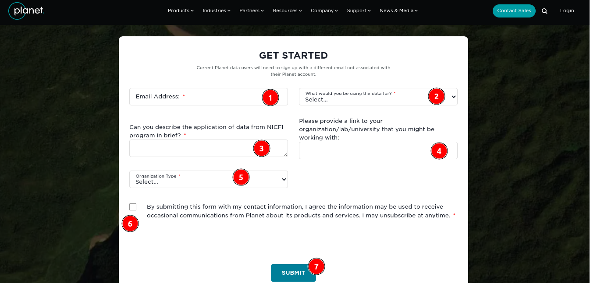

# Signup Page Documentation

## Introduction

To access Planet's data, users need to register through the Planet.com signup page. This document provides a detailed guide to the signup process, ensuring new users can easily create an account and start utilising Planet's data services.

## Signup URL

To begin the registration process, navigate to the following URL: [Planet.com Signup Page](https://www.planet.com/nicfi/#sign-up)

> Note: Current Planet data users must register with a different email not associated with their existing Planet account.

## Why Register on Planet.com?

Registering on Planet.com allows users to access the latest NICFI imagery. Through Norway’s International Climate & Forests Initiative (NICFI), users can now access Planet’s high-resolution, analysis-ready mosaics of the world’s tropics. This initiative aims to help reduce and reverse the loss of tropical forests, combat climate change, and conserve biodiversity.

## Registration Form Fields

1. **Email:** The user needs to enter a valid email address that they will use to log into their Planet account. This email address should not be associated with any existing Planet account.

2. **What would you be using data for?:** The user needs to select the primary purpose for which they intend to use Planet's data. This helps Planet understand user needs and improve their services accordingly.

3. **Can you describe the application of data from NICFI program in brief?:** Provide a brief description of how the user plans to use the data from the NICFI program. This information helps Planet understand the diverse applications of their data.

4. **Please provide a link to your organization/lab/university that you might be working with:** Enter the URL of the organisation, lab, or university the user is affiliated with. This adds credibility to the user's application and helps Planet verify the user's affiliation.

5. **Organisation type:** Select the type of organisation the users are associated with from the provided options. This helps categorise users and tailor communications and services.

6. **Agreement Checkbox:** By submitting this form with my contact information, I agree the information may be used to receive occasional communications from Planet about its products and services. I may unsubscribe at anytime.

7. **Submit Button:** Click this button to submit the registration form. Ensure all the fields are filled out correctly before submitting.

After filling out all the required fields and agreeing to the terms, click the `Submit` button. The user will receive a confirmation email at the address provided, and further instructions on how to access Planet's data will be sent to the user.
